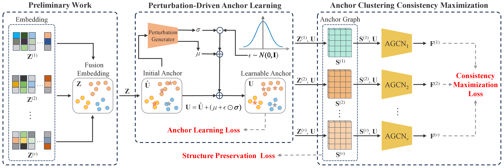

# Towards Learnable Anchor for Deep Multi-View Clustering  (AAAI-25)

The code for "Deep Multi-view Anchor Clustering" (DMAC).




## Run DMAC

```python
Python main.py
```

The proposed DMAC is implemented with Python 3.11.4 on Pytorch framework.

torch==2.0.1

numpy==1.26.0

scikit-learn==1.3.1

scipy==1.11.3

## Citation

```
@inproceedings{DMAC,
	author       = {Wang, Bocheng and Zeng, Chusheng and Chen, Mulin and Li, Xuelong},
	title        = {Towards Learnable Anchor for Deep Multi-View Clustering},
	booktitle    = {Proceedings of the AAAI Conference on Artificial Intelligence},
	pages        = {21044--21052},
	year         = {2025}
}
```

